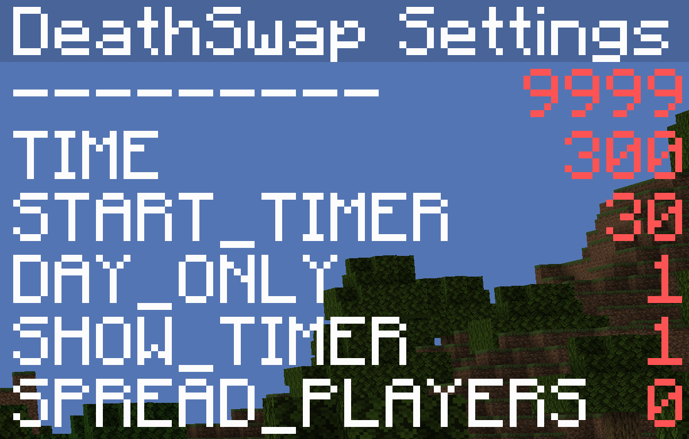

# DeathSwap
A simple Minecraft DeathSwap datapack.

**Features:**

​	Configurable!

​	

​	Use `/trigger Settings_DS` to configure the datapack.

​	A smart game request system!

​	Automatic death detection.

**How to use**

​	1. Change settings by using `/trigger Settings_DS`

​	2. Start a game using `/trigger DS_START_GAME`

​	3. Wait for players

